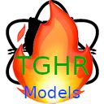

# TopGHRepos   
Searches the top repos on GitHub by stars 

### Nuget
| Module | Nuget |
| --- | --- |
|  Models |  |
|  Data |  |

### Development 
| Workflow | Status |
| --- | --- |
| Check Build |  |
| Build Nuget |  |
| Build Executables |  |
